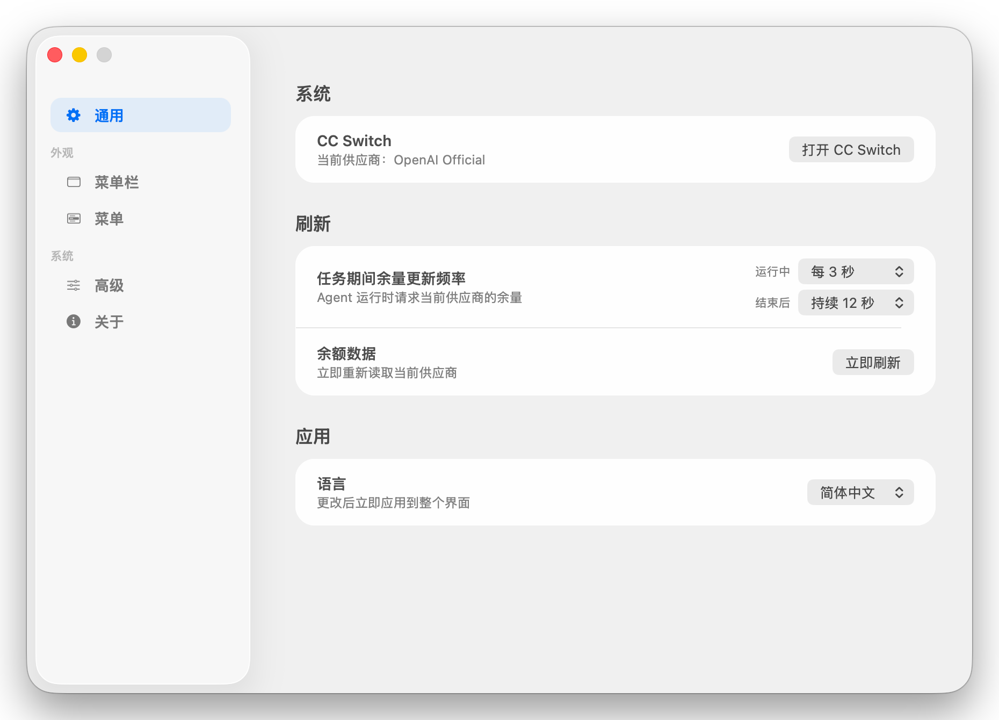
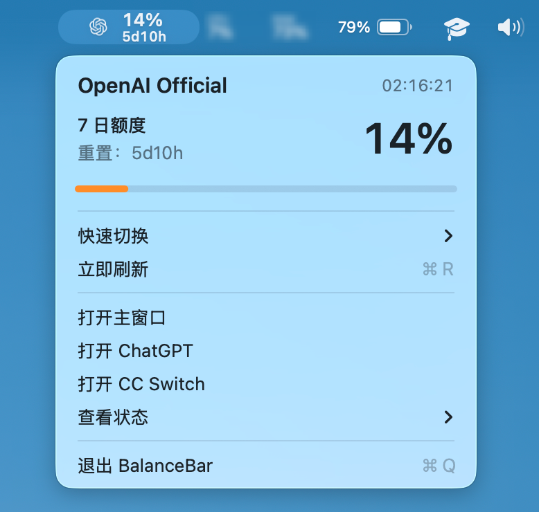
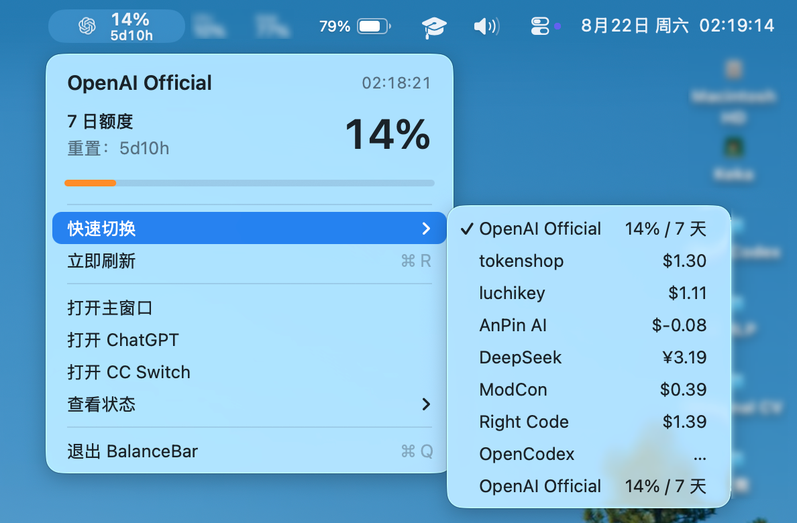
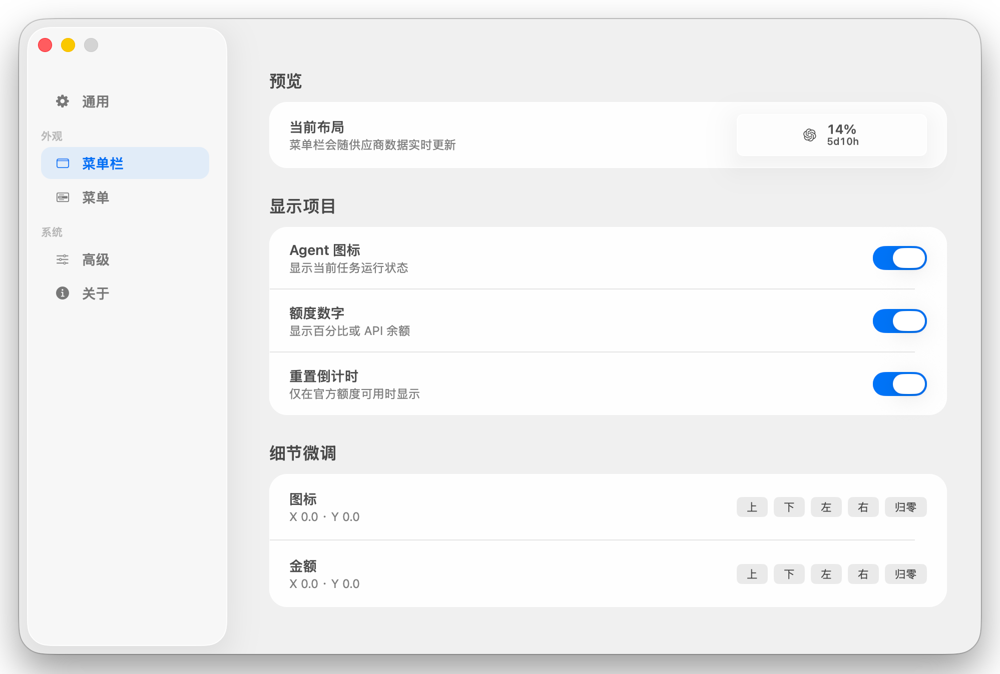
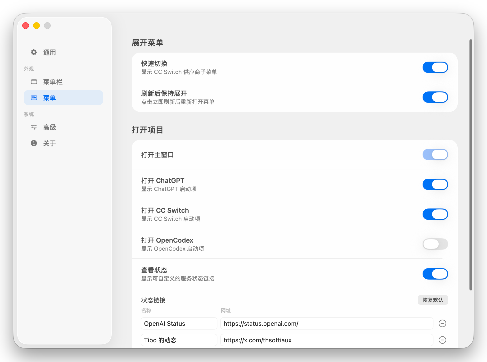

# BalanceBar

> 把 Codex 与 Claude Code 的额度、余额和运行状态放进 macOS 菜单栏。

[](https://github.com/huanmeng06/BalanceBar/actions/workflows/build-and-test.yml)    

BalanceBar 是一款基于 CC Switch 的原生 macOS 菜单栏工具。它会跟随当前使用的 Codex 或 Claude Code 供应商，在菜单栏中显示官方账号剩余额度或第三方 API 余额，并提供任务状态动画、供应商快速切换、OpenCodex 集成、手动刷新和可定制的状态链接。



## 功能亮点

- **菜单栏实时余量**：官方账号显示剩余百分比与重置倒计时，第三方供应商显示 API 余额。
- **Codex 与 Claude Code 联动**：根据前台应用和终端中的 Claude Code 进程自动切换当前客户端及图标。
- **任务状态提示**：Codex 执行任务时旋转图标；Claude Code 执行任务时播放思考动画。
- **跟随 CC Switch**：监听 `~/.cc-switch/cc-switch.db` 的变化，供应商切换后自动刷新，并以定时轮询兜底。
- **快速切换供应商**：无需离开菜单栏即可查看各供应商余量并切换当前供应商。
- **OpenCodex 集成**：可自动发现或手动配置本地 OpenCodex 仪表盘，并在菜单中展示、切换精选模型。
- **原生设置窗口**：可调整菜单栏显示项、刷新策略、下拉菜单入口、供应商排序、状态链接及语言。
- **多语言界面**：支持跟随系统、简体中文、繁體中文（台灣）、繁體中文（香港）、日本語、한국어、Español、Deutsch 和 Français。

繁體中文资源使用 `zh-Hant-TW` 与 `zh-Hant-HK` 两个区域标识。跟随系统时，
`zh-TW`/`zh-Hant-TW` 选择台湾版本，`zh-HK`/`zh-Hant-HK` 选择香港版本，
`zh-MO`/`zh-Hant-MO` 在没有澳门独立资源时按兼容策略选择香港版本；泛化的
`zh-Hant` 默认选择台湾版本。旧版保存的 `traditionalChinese` 偏好值会迁移到台湾版本。
- **诊断信息**：应用内可查看运行日志，并可直接在 Finder 中定位日志文件。

## 界面预览

| 菜单栏额度概览 | 供应商快速切换 |
| :---: | :---: |
|  |  |

| 菜单栏显示设置 | 下拉菜单与状态链接设置 |
| :---: | :---: |
|  |  |

## 额度与余额如何显示

BalanceBar 不维护一套独立于 CC Switch 的供应商清单，而是读取 CC Switch 中已有的供应商配置，并根据当前供应商自动选择展示方式：

- **官方供应商**：使用本机已有的 Codex 或 Claude Code 登录凭据查询官方额度，显示剩余百分比、额度周期和重置倒计时。
- **第三方供应商**：读取 CC Switch 中已启用的用量脚本和接口配置，查询并显示可用余额及币种；快速切换列表也会复用这些结果显示各供应商摘要。

为了适配常见配置，BalanceBar 已内置 DeepSeek、阶跃星辰、SiliconFlow 中国站与国际站、OpenRouter、Novita AI 的余额响应解析，同时兼容 New API、RightCode 等面板格式。其他供应商只要在 CC Switch 中提供了兼容且完整的用量脚本，也可以显示余额。

> 最终能否查询成功取决于供应商接口，以及 CC Switch 中的凭据和用量脚本配置。BalanceBar 不会在仓库中保存任何凭据。

## 系统要求

- macOS 14 Sonoma 或更高版本
- 已安装并配置 CC Switch
- 从源码构建时需要 Xcode 或 Swift 命令行工具
- 查看官方额度时，需要本机已登录相应的 Codex / Claude Code 账号

## 从源码构建

### 使用构建脚本

```bash
git clone https://github.com/huanmeng06/BalanceBar.git
cd BalanceBar
./work/balance-bar/build.sh
codesign --force --sign - work/balance-bar/build/BalanceBar.app
open work/balance-bar/build/BalanceBar.app
```

产物位于 `work/balance-bar/build/BalanceBar.app`。如需安装到“应用程序”目录，可在构建完成后手动拖入 `/Applications`。

开发调试可以使用独立的 Bundle ID 和输出目录：

```bash
./work/balance-bar/build.sh dev
codesign --force --sign - work/balance-bar/build/dev/BalanceBar-dev.app
open -n work/balance-bar/build/dev/BalanceBar-dev.app
```

开发版名称为 `BalanceBar Dev`，不会覆盖生产版，也不会修改仓库中的 `Info.plist`。

### 使用 Xcode

打开 `BalanceBar.xcodeproj`，选择共享的 `BalanceBar` Scheme 后直接运行。命令行构建示例：

```bash
xcodebuild \
  -project BalanceBar.xcodeproj \
  -scheme BalanceBar \
  -configuration Debug \
  -derivedDataPath /tmp/BalanceBar-DerivedData \
  CODE_SIGNING_ALLOWED=NO \
  build
```

## 使用说明

1. 先启动 CC Switch，并确保 Codex 或 Claude Code 至少配置了一个当前供应商。
2. 启动 BalanceBar；应用会读取当前供应商并在菜单栏显示额度或余额。
3. 点击菜单栏项目可以查看详细信息、立即刷新、快速切换供应商或打开主窗口。
4. 在主窗口中可查看供应商列表，并通过“通用”“菜单栏”“菜单”“高级”页面调整行为。
5. 关闭主窗口后，BalanceBar 会继续在菜单栏运行；可通过菜单中的“打开主窗口”再次打开。

## 数据与隐私

BalanceBar 在本机完成配置读取、状态监听和界面展示：

- 读取 CC Switch 的数据库与设置：`~/.cc-switch/cc-switch.db`、`~/.cc-switch/settings.json`。
- 读取本机 Codex / Claude Code 凭据，以直接请求相应官方额度接口。
- 查询第三方余额时，会向 CC Switch 中相应供应商配置指定的接口发送请求，以更新当前余额和快速切换摘要。
- 识别到 OpenCodex 时，可读取其本地配置并访问回环地址上的管理接口，用于展示精选模型和执行切换。
- 使用“快速切换”时，会更新 CC Switch 当前供应商，并按其配置同步 `~/.codex` 或 `~/.claude` 下的客户端配置。
- 凭据不会写入本仓库；运行日志主要记录状态、耗时和错误原因，不应记录令牌正文。

建议只使用你信任的供应商配置和用量接口。

## 开发与测试

项目使用原生 AppKit + SwiftUI 构建，无第三方 Swift Package 依赖；数据层直接使用 SQLite3 读取和更新 CC Switch 状态。

```text
work/balance-bar/BalanceBar.swift        应用入口、生命周期与组件装配
work/balance-bar/AppPreferences.swift   用户偏好及旧版本配置迁移
work/balance-bar/Sources/AppCore/        本地化与跨界面通用规则
work/balance-bar/Sources/Domain/         供应商、快照、额度查询等领域模型
work/balance-bar/Sources/Services/       数据库、网络、凭据与刷新协调
work/balance-bar/Sources/Monitoring/     Codex 与 Claude Code 任务状态监听
work/balance-bar/Sources/UI/MenuBar/     菜单栏布局、菜单和活动动画
work/balance-bar/Sources/UI/Dashboard/   主窗口、设置页和供应商页面
Tests/BalanceBarTests/                   XCTest 单元测试
```

运行完整测试：

```bash
xcodebuild \
  -project BalanceBar.xcodeproj \
  -scheme BalanceBar \
  -configuration Debug \
  -derivedDataPath /tmp/BalanceBar-DerivedData \
  -destination 'platform=macOS,arch=arm64' \
  CODE_SIGNING_ALLOWED=NO \
  ARCHS=arm64 \
  ONLY_ACTIVE_ARCH=YES \
  build-for-testing

xcodebuild \
  -project BalanceBar.xcodeproj \
  -scheme BalanceBar \
  -configuration Debug \
  -derivedDataPath /tmp/BalanceBar-DerivedData \
  -destination 'platform=macOS,arch=arm64' \
  CODE_SIGNING_ALLOWED=NO \
  ARCHS=arm64 \
  ONLY_ACTIVE_ARCH=YES \
  -parallel-testing-enabled NO \
  test-without-building
```

GitHub Actions 会在 Pull Request 更新时并行执行 CLI 构建、本地化探针和 Xcode 测试构建，全部通过后再串行执行 XCTest；也可以手动触发。

进一步了解代码组织和贡献流程：

- [架构说明](docs/architecture.md)
- [开发、构建与测试指南](docs/development.md)
